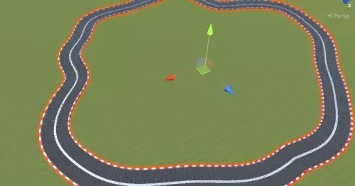

# Unity Procedural Mesh Generation

This project is following and implementing the ideas of the 
[3D Procedural Mesh Generation Fundamentals in Unity](https://www.udemy.com/course/unity_procgen) course on Udemy.

The core idea here is to build meshes at runtime, with some (naive) examples for

- Cubes and
- Pyramids,

As well as "planar" mesh generation for:

- Planes
- Chessboards (by alternating submesh indexes)
- Landscapes (by varying height)

## Procedural landscape generation

One of the more interesting approaches here, it mainly uses

- Time- and position based Perlin noise,
- Mesh ready for tiling (due to transform awareness) and
- Height-based submesh assignment.

## Procedural path generation

Shape extrusion along a path defined by
a set of waypoints.

A similar approach is used to generate a racetrack including walls and a mesh collider:

